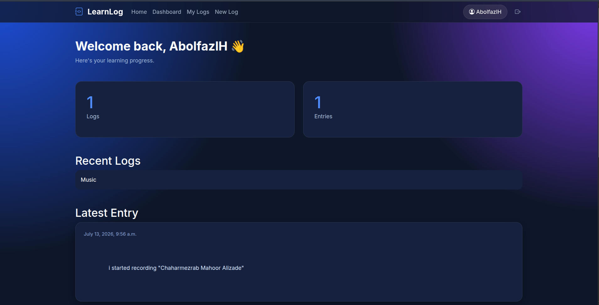
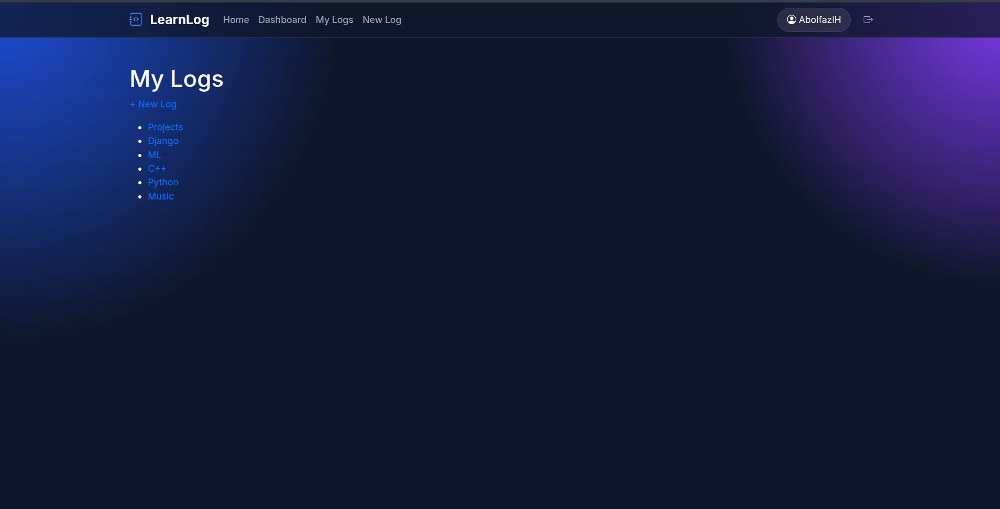
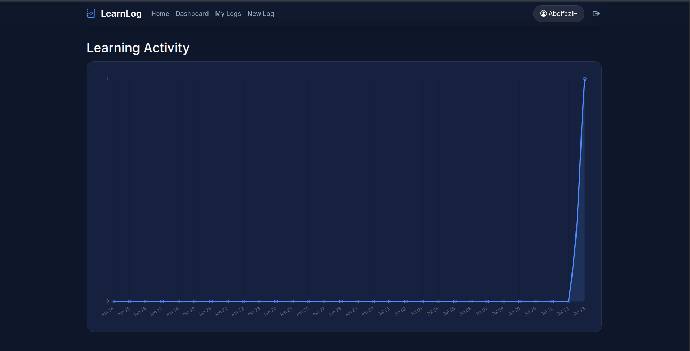
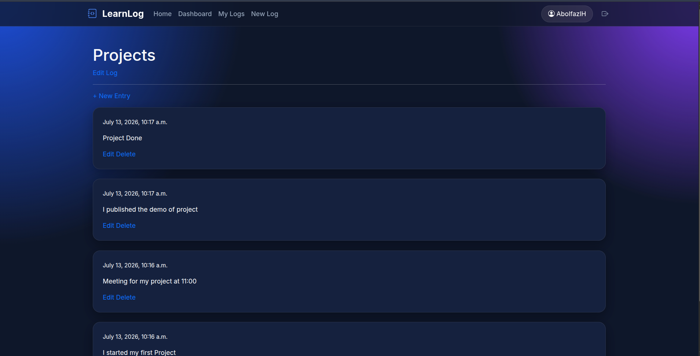

# LearnLog

A modern learning journal built with Django.

## Features

- User Authentication
- Dashboard
- Beautiful Dark UI
- Responsive Design
- Learning Logs
- Entries
- Activity Chart
- Search-ready Architecture

## Tech Stack

- Django 6
- Bootstrap 5
- Chart.js
- SQLite

## Installation

```bash
git clone https://github.com/USERNAME/LearnLog.git

cd LearnLog

python -m venv .venv

source .venv/bin/activate

pip install -r requirements.txt

python manage.py migrate

python manage.py runserver
```

# Screenshots

## Home


---

## Dashboard



---

## Logs



---

## Chart



---

## Entry

